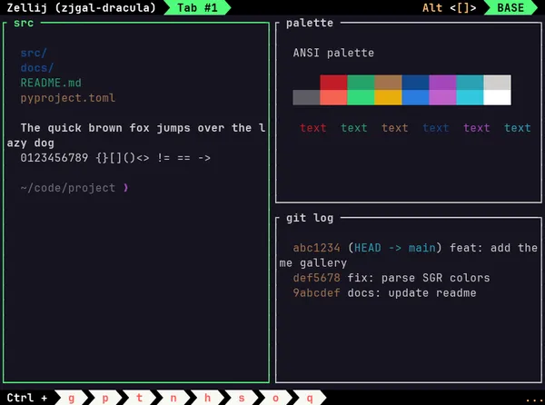

# Zellij Theme Gallery

Screenshots of all 41 [zellij](https://zellij.dev) built-in themes — captured
fully headless, no desktop session or window flashing required.

**Browse: <https://rodbv.github.io/zellij-theme-gallery/>**

[](https://rodbv.github.io/zellij-theme-gallery/themes/dracula.html)

The gallery has a searchable index with dark/light filters, and a detail page
per theme with the full screenshot and copy-paste commands to apply it.

## Why

Zellij ships 41 themes but no way to preview them without applying each one.
This repo screenshots them all automatically so you can pick by looking.

## How it works

No GUI is involved at any point:

1. **[`theme_gallery.py`](theme_gallery.py)** starts zellij inside an isolated
   tmux server (own socket, your sessions untouched) once per theme, using a
   3-pane layout whose panes print sample content — file listing, ANSI
   palette swatches, git log.
2. `tmux capture-pane -e` dumps the rendered screen *with* ANSI color codes;
   tmux acts as the headless terminal emulator. Zellij themes are truecolor,
   so captured chrome colors are exact.
3. A small SGR parser renders the captured screen to PNG with Pillow using a
   Nerd Font (zellij's arrow glyphs render correctly).
4. **[`build.py`](build.py)** generates WebP thumbnails and the static HTML
   site, classifying each theme dark/light by sampling its tab-bar luminance.

## Usage

Requirements: `zellij`, `tmux`, [`uv`](https://docs.astral.sh/uv/),
ImageMagick (`magick`), a Nerd Font (default: JetBrainsMono Nerd Font).

```bash
# screenshot every built-in theme (~4 min)
./theme_gallery.py --out images

# or just a few
./theme_gallery.py --themes dracula,nord,kanagawa --out /tmp/preview

# rebuild thumbnails + HTML
./build.py
```

Both scripts are single-file `uv run` scripts — dependencies (Pillow) are
declared inline and installed on first run.

### Options

| Flag | Default | Description |
|---|---|---|
| `--themes a,b,c` | all 41 | subset of themes to capture |
| `--out DIR` | `~/Pictures/zellij-themes` | output directory |

## License

[MIT](LICENSE)
